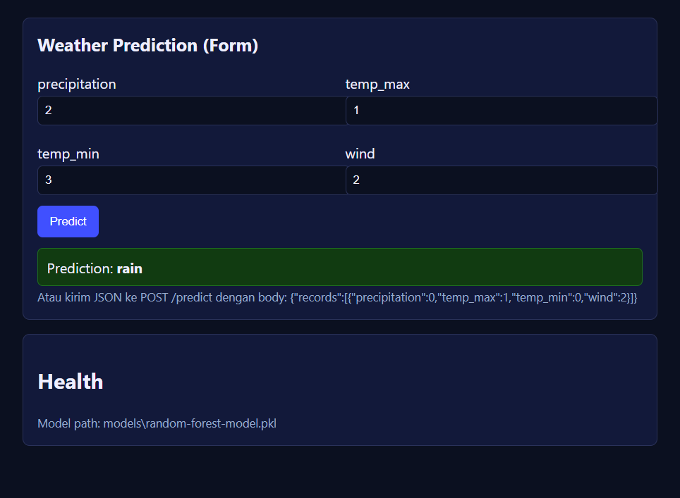

# Demo Prediksi Cuaca Sederhana (FastAPI)



Tujuan: jalankan model yang disimpan di file `.pkl` dan pakai lewat browser atau API. Dibuat sesederhana mungkin: cukup 1 file `app.py`.

- Lokasi model: `models/random-forest-model.pkl`
- Buka di browser: `http://127.0.0.1:8000/`
- Swagger (dokumen API): `http://127.0.0.1:8000/docs`

Apa yang tersedia:
- `GET /` — Halaman form untuk input 4 angka dan dapat 1 prediksi
- `GET /health` — Cek status model
- `POST /predict` — API JSON untuk prediksi banyak data sekaligus

### Request body (POST /predict)

```json
{
  "records": [
    {"precipitation": 0.0, "temp_max": 1.2, "temp_min": -0.5, "wind": 2.3},
    {"precipitation": 4.5, "temp_max": 6.7, "temp_min": 1.1, "wind": 0.9}
  ]
}
```


### Contoh hasil

```json
{
  "predictions": ["drizzle", "rain"]
}
```

Catatan: Server akan mengembalikan NAMA label (string) jika `models/label-encoder.pkl` ada (atau model memang output string). Kalau tidak ada, bisa keluar angka (index kelas) sebagai fallback.

## Cara cepat (3 langkah)

1) Pastikan file model ada: `models/random-forest-model.pkl`
2) Double-click `run.bat` di folder ini (Windows)
3) Buka `http://127.0.0.1:8000/` (isi form dan klik Predict)

### Kirim lewat API (opsional)

Kamu bisa kirim JSON seperti ini ke `POST /predict`:

```json
{
  "records": [
    {"precipitation": 0.0, "temp_max": 1.2, "temp_min": -0.5, "wind": 2.3}
  ]
}
```

Kamu juga bisa coba `client_demo.py` untuk contoh pemanggilan.

## Catatan

- Jika file model tidak bisa dibuka, biasanya versi `scikit-learn` tidak cocok dengan versi saat melatih model.
- Jika saat melatih kamu pakai `LabelEncoder`/`Scaler`, sebaiknya masukkan ke pipeline dan simpan bareng, atau pastikan preprocess sama saat prediksi.

## Run via Command Prompt (Windows)

Below are copyable commands for Windows. Use PowerShell (recommended) or classic Command Prompt.

### PowerShell (Windows)

```powershell
# 1) Masuk ke folder service
cd "d:\BeData\SMK Telkom\Project Analisis Data\deployment\fastapi"

# 2) Create and activate a virtual environment
py -3 -m venv .venv
.\.venv\Scripts\Activate

# 3) Install dependencies
pip install -r requirements.txt

# 4) Run the API server
uvicorn app:app --host 127.0.0.1 --port 8000 --reload

# Buka form: http://127.0.0.1:8000/ ; Swagger: http://127.0.0.1:8000/docs
```

Kalau `py` tidak ada, ganti `py -3` dengan `python`.

Quick test from another PowerShell window:

```powershell
# Health check
Invoke-RestMethod -Method Get http://127.0.0.1:8000/health | ConvertTo-Json -Depth 5

# Predict using named records
$payload = @{ records = @(@{ precipitation=0; temp_max=1.2; temp_min=-0.5; wind=2.3 }) } | ConvertTo-Json
Invoke-RestMethod -Method Post http://127.0.0.1:8000/predict -ContentType 'application/json' -Body $payload | ConvertTo-Json -Depth 5

# Or run the small client script
python client_demo.py
```

### Command Prompt (cmd.exe)

```bat
REM 1) Masuk ke folder service
cd /d "d:\BeData\SMK Telkom\Project Analisis Data\deployment\fastapi"

REM 2) Create and activate a virtual environment
py -3 -m venv .venv
.\.venv\Scripts\activate.bat

REM 3) Install dependencies
pip install -r requirements.txt

REM 4) Run the API server
uvicorn app:app --host 127.0.0.1 --port 8000 --reload
```

Kalau port 8000 dipakai aplikasi lain, ganti port (misal `--port 8080`).
