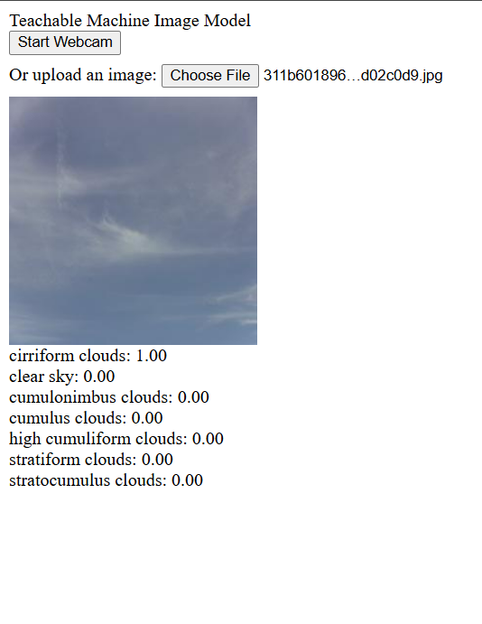

# Panduan Singkat: Jalankan Model Teachable Machine di Browser (TensorFlow.js)



Tujuan: bikin halaman web sederhana yang bisa menjalankan model gambar langsung di browser. Tidak perlu server Python/Flask, cukup file HTML + file model TFJS.

- Halaman demo: `index.html`
- File model: ada di `models/tfjs/` (di luar folder ini)
  - Minimal: `model.json`, `metadata.json`, dan file `*.bin`
- Di `index.html` kita pakai path ini: `../../models/tfjs/` (relatif dari file ini)

Halaman mendukung 2 cara input:
- Webcam (klik tombol "Start Webcam")
- Upload gambar (pilih file dari komputer)

---

## 1) Siapkan model TFJS

Kalau pakai Google Teachable Machine:
1. Buka project → Export Model → pilih "Tensorflow.js"
2. Download file model (`model.json`, `metadata.json`, dan file `.bin`)
3. Taruh semua file ke folder `models/tfjs/` di repo ini

Contoh struktur:
```
models/
  tfjs/
    model.json
    metadata.json
    group1-shard1ofN.bin
    group1-shard2ofN.bin
    ...
```

---

## 2) Jalankan lokal (pilih salah satu)

Penting: Jangan buka `index.html` pakai double‑click (file://). Harus lewat web server sederhana.

- Opsi A — VS Code Live Server (paling mudah)
  1) Buka repo ini di VS Code
  2) Install ekstensi "Live Server"
  3) Klik kanan `deployment/tensorflow-js/index.html` → "Open with Live Server"
  4) Browser otomatis terbuka (misal `http://127.0.0.1:5500/deployment/tensorflow-js/index.html`)

- Opsi B — Python (PowerShell, Windows)
  Jalankan dari root repo:
  ```powershell
  cd "d:\BeData\SMK Telkom\Project Analisis Data"
  py -3 -m http.server 5500
  # Buka di browser:
  # http://127.0.0.1:5500/deployment/tensorflow-js/index.html
  ```

Catatan: Kita start server dari root repo supaya path `../../models/tfjs/` mengarah ke `models/tfjs/`.

---

## 3) Cara pakai

- Klik "Start Webcam" lalu izinkan kamera. Halaman akan menampilkan video webcam dan hasil prediksi (update terus).
- Atau upload gambar lewat input file. Gambar akan muncul (preview) dan langsung diprediksi sekali.
- Nama kelas dan probabilitas tampil di list.

---

## 4) Ubah lokasi model / tampilan

- Ganti lokasi model:
  - Buka `index.html`, cari `const MODEL_BASE = "../../models/tfjs/";`
  - Kalau memindahkan file model, ubah string itu (akhiri dengan `/`).

- Gaya tampilan (CSS):
  - Bisa tambah CSS sederhana langsung di `<style>` atau file `.css` terpisah.

- Hentikan loop webcam (opsional):
  - Bisa tambahkan tombol "Stop Webcam" yang memanggil `webcam.stop()` dan menghentikan `requestAnimationFrame(loop)`.

---

## 5) Masukkan ke website kamu

Contoh minimal (load dan prediksi gambar):

```html
<script src="https://cdn.jsdelivr.net/npm/@tensorflow/tfjs@latest/dist/tf.min.js"></script>
<script src="https://cdn.jsdelivr.net/npm/@teachablemachine/image@latest/dist/teachablemachine-image.min.js"></script>
<script>
  const MODEL_BASE = "/path/ke/tfjs/"; // wajib diakhiri '/'
  let model;
  async function loadModel(){
    model = await tmImage.load(MODEL_BASE + "model.json", MODEL_BASE + "metadata.json");
  }
  async function predictOn(imgEl){
    const preds = await model.predict(imgEl);
  preds.forEach(p => console.log(p.className, p.probability));
  }
</script>
```

---

## 6) Troubleshooting (masalah umum)

- Kamera tidak muncul / tidak minta izin:
  - Pastikan buka lewat `http://` (bukan `file://`).
  - Coba `http://127.0.0.1:5500` (atau port yang kamu pakai).

- Model 404 / tidak ketemu:
  - Pastikan file ada di `models/tfjs/`.
  - Server dijalankan dari root repo.
  - Cek Network tab di DevTools untuk melihat path yang diakses.

- Error `URL.createObjectURL is not a function`:
  - Jangan pakai variabel bernama `URL` di JS kamu (menutupi `window.URL`).
  - Di file ini sudah aman: kita pakai `MODEL_BASE` dan `(window.URL || window.webkitURL).createObjectURL(file)`.

- Prediksi aneh / kelas tidak sesuai:
  - Pastikan model yang dipakai benar.
  - Cek `metadata.json` dan jumlah kelas sesuai harapan.

---

## 7) Deploy online (gratis/mudah)

Karena ini website statis (HTML + JS), kamu bisa upload ke:
- GitHub Pages
- Netlify / Vercel / Cloudflare Pages
- Server statis apa pun (Nginx, Apache, dsb.)

Pastikan `index.html` bisa diakses publik, dan `model.json` + file `.bin` bisa diambil dari path yang cocok. Kalau model kamu di-host di tempat lain (CDN), ubah `MODEL_BASE` jadi URL penuh model tersebut.
